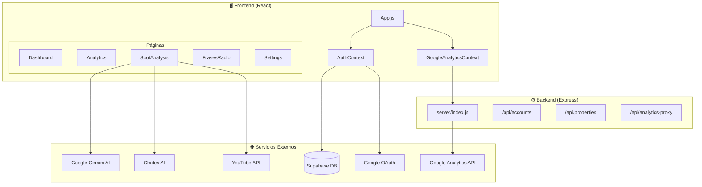
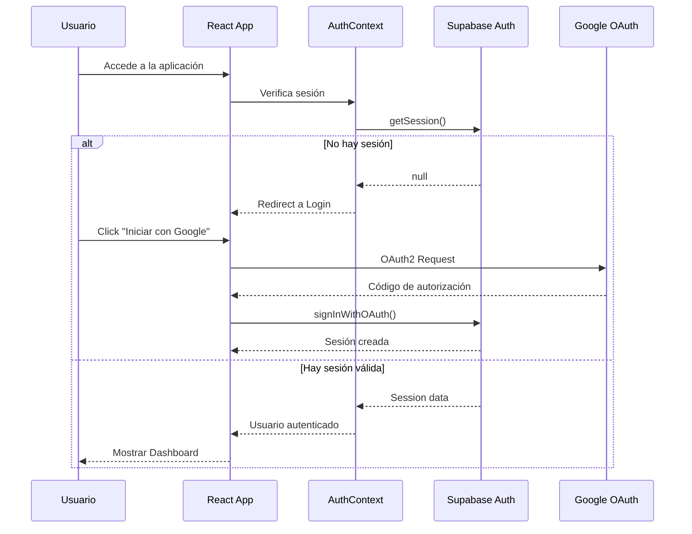
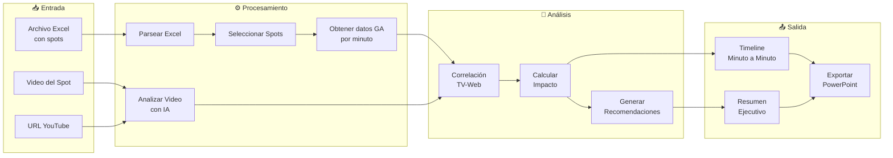
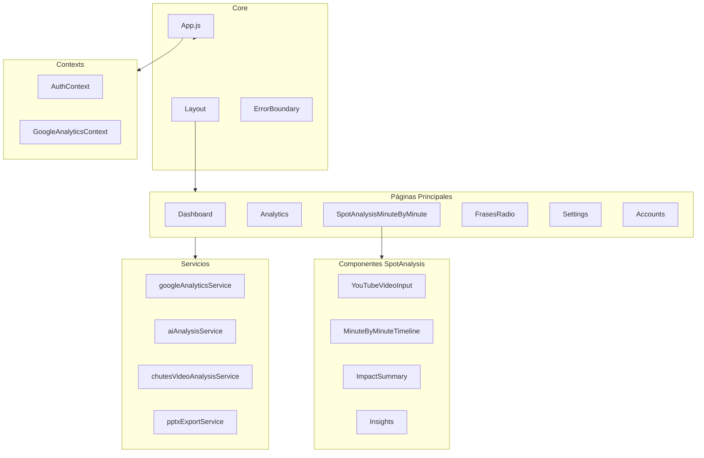
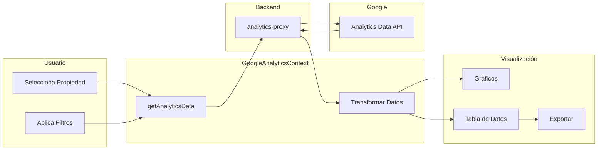

# 📊 Documentación Técnica: iMetrics

**Dashboard de Analítica para TV/Radio**

---

## 📝 Descripción General

iMetrics es una plataforma de análisis que conecta **datos de Google Analytics** con el rendimiento de **spots publicitarios de TV/Radio**. Permite medir el impacto real de campañas televisivas en el tráfico web.

---

## 🏗️ Arquitectura del Sistema



---

## 🔐 Flujo de Autenticación



---

## 📊 Flujo de Análisis de Spots



---

## 🗂️ Estructura de Componentes



---

## 📁 Estructura de Carpetas

```
src/
├── components/           # Componentes React
│   ├── Auth/            # Login, Register, Callbacks
│   ├── Dashboard/       # Panel principal
│   ├── Analytics/       # Visualización de métricas
│   ├── SpotAnalysis/    # 🌟 Módulo principal
│   │   ├── SpotAnalysisMinuteByMinute.js
│   │   └── components/  # 20 subcomponentes
│   ├── FrasesRadio/     # Análisis de frases
│   ├── Settings/        # Configuración
│   └── UI/              # Componentes reutilizables
│
├── contexts/            # Estado global
│   ├── AuthContext.js   # Autenticación
│   └── GoogleAnalyticsContext.js
│
├── services/            # Lógica de negocio
│   ├── googleAnalyticsService.js
│   ├── aiAnalysisService.js
│   ├── chutesVideoAnalysisService.js
│   ├── minuteByMinuteAnalysisService.js
│   └── pptxExportService.js
│
├── config/              # Configuración
├── hooks/               # Custom hooks
└── utils/               # Utilidades

server/
└── index.js             # API Express (proxy a GA)
```

---

## 🔧 Servicios Principales

| Servicio | Descripción |
|----------|-------------|
| `googleAnalyticsService` | Conexión con Google Analytics Data API |
| `aiAnalysisService` | Análisis con Google Gemini AI |
| `chutesVideoAnalysisService` | Análisis de video con IA multimodal |
| `minuteByMinuteAnalysisService` | Análisis temporal de spots |
| `pptxExportService` | Generación de reportes PowerPoint |
| `youtubeService` | Integración con YouTube API |

---

## 🌊 Flujo de Datos: Analytics



---

## ⚙️ Variables de Entorno Requeridas

```bash
# Supabase
REACT_APP_SUPABASE_URL=https://xxx.supabase.co
REACT_APP_SUPABASE_ANON_KEY=eyJ...

# Google OAuth
REACT_APP_GOOGLE_CLIENT_ID=xxx.apps.googleusercontent.com
REACT_APP_GOOGLE_CLIENT_SECRET=xxx

# APIs de IA
REACT_APP_GEMINI_API_KEY=xxx
REACT_APP_CHUTES_API_KEY=xxx

# YouTube
REACT_APP_YOUTUBE_API_KEY=xxx

# Entorno
REACT_APP_API_URL=http://localhost:3001
REACT_APP_ENVIRONMENT=development
```

---

## 🚀 Comandos

| Comando | Descripción |
|---------|-------------|
| `npm start` | Inicia servidor de desarrollo |
| `npm run build` | Compila para producción |
| `npm run serve` | Inicia servidor Express |

---

## 📈 Métricas Disponibles (Google Analytics)

| Categoría | Métricas |
|-----------|----------|
| **Tráfico** | activeUsers, sessions, users, newUsers |
| **Contenido** | pageviews, eventCount |
| **Engagement** | bounceRate, sessionDuration, engagementRate |
| **Conversiones** | conversions |

---

## 🎯 Funcionalidades Clave

1. **Dashboard** - Vista general de cuentas y propiedades GA
2. **Analytics** - Explorador de datos con gráficos personalizables
3. **SpotAnalysis** - Análisis de correlación TV-Web minuto a minuto
4. **FrasesRadio** - Análisis de frases publicitarias con IA
5. **Exportación PPTX** - Reportes profesionales en PowerPoint
